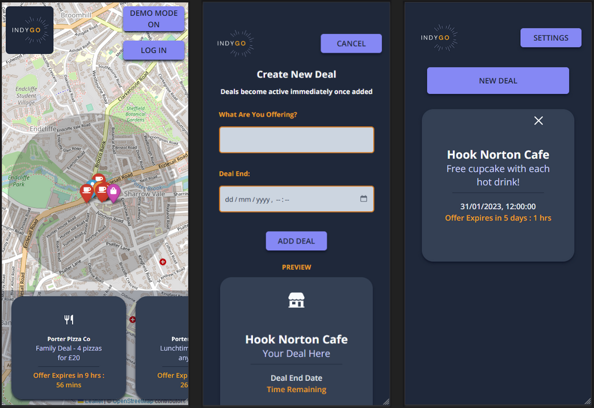

# **IndyGo**

---

### [Deployed here, check it out!](https://indygo.netlify.app/)

---

#### IndyGo is a mobile application that allows local independent businesses to fight back against economic pressures by offering live deals to consumers within a walkable distance. Consumers can use IndyGo to get active and shop local with a map of independent businesses in their area, and can scroll through a carousel of deals available to them.

---

#### The app consists of two different user journeys, the consumer and the business.

All users start on the Landing Page. This page allows any user, regardless of whether they have an account or not, to see a map of the local businesses on the app available in their area, and the deals they have.

Once the user clicks the log-in button, they are pathed to the login page where they can sign in with Facebook or Google, or create an account with an email address.

The user is then asked if they are signing in as a consumer or a business. If a consumer account is created the user is then routed back to the landing page where they can continue using the app.

A business account needs a bit more information, which the user can then fill out. They are then pathed to the business side of the application, the business home.  
From this page they can view their active deals, create new deals and delete deals if neccessary.

---

##### _Screenshots of the app **landing page** the **new deal page** and **business home page**_

---

#### We thank you for your time, interest and any feedback in this project.

 

### Project authors

- [Lewis Gorman-Neale](https://github.com/lewisgormanneale)
- [Stefan Saltalamacchia](https://github.com/OmertaDevs)
- [Nick Hughes](https://github.com/Mrbusy13)
- [Krishan Desorh](https://github.com/kdesorh14)
- [Nathan Gray](https://github.com/november-golf)
- [Andrew Rohling](https://github.com/AndyRoo0)

---

### Project Tech Stack

#### _Design & Planning_

- [Miro](https://miro.com/)
- [Trello](https://trello.com/)
- [Figma](https://www.figma.com)
- [Canva](https://www.canva.com/)

#### _Code & Development_

- [Next.JS](https://nextjs.org/)
- [TypeScript](https://www.typescriptlang.org/)
- [TailWindCSS](https://tailwindcss.com/)
- [Leaflet.JS](https://leafletjs.com/)
- [Supabase (& Auth)](https://supabase.com/)
- [JSDoc](https://jsdoc.app/)

#### _Testing_

- [Jest](https://jestjs.io/)
- [Cypress](https://www.cypress.io/)

#### _Deployment_

- [Netlify](https://www.netlify.com/)

---

## 

---
